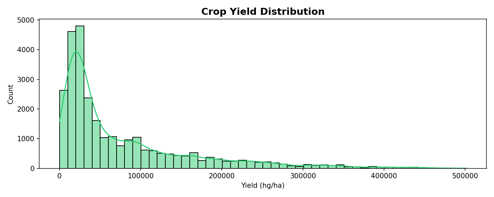
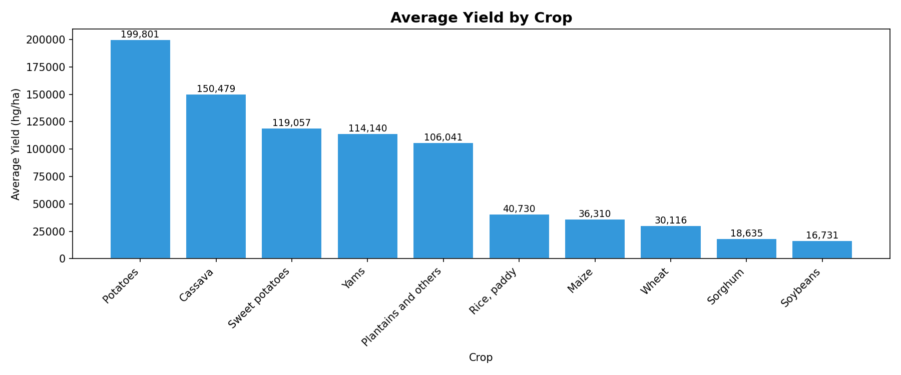
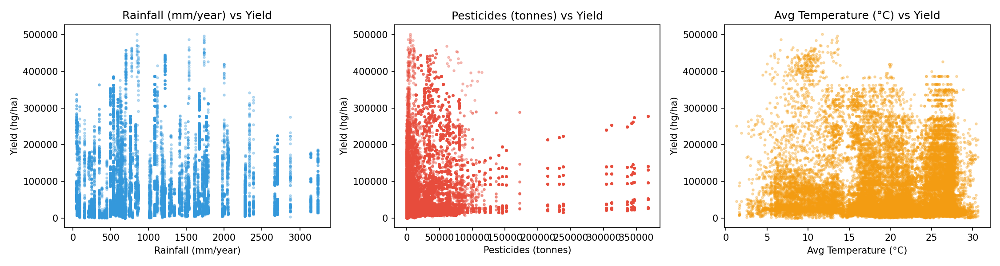
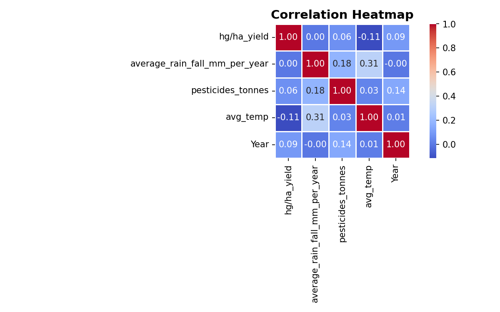
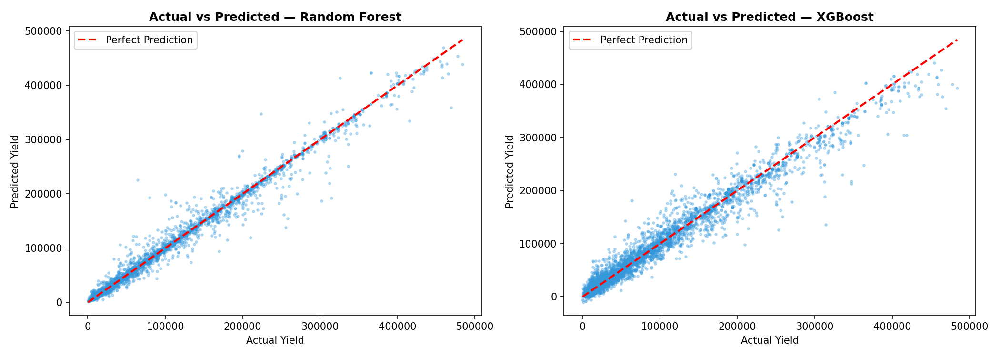
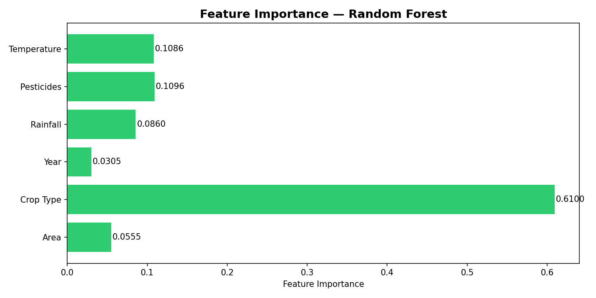
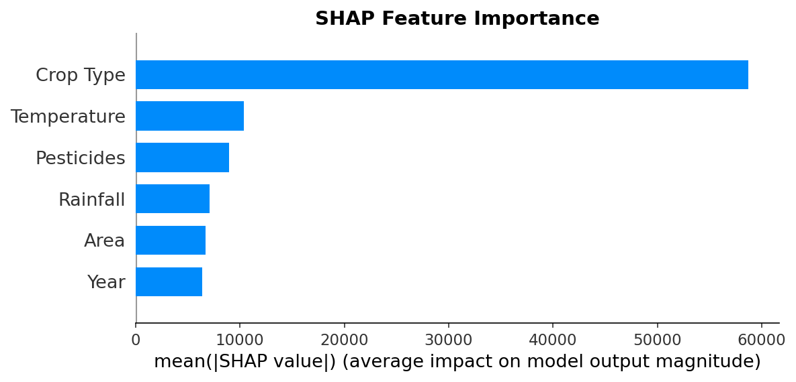

# 🌾 Crop Yield Prediction

> Machine learning models to predict agricultural crop yields using historical climate and pesticide data across 101 countries (1990–2013).

[](https://python.org)
[](https://scikit-learn.org)
[](https://xgboost.readthedocs.io)
[](https://jupyter.org)

---

## 📊 Visual Overview

| Yield Distribution | Average Yield by Crop |
|:---:|:---:|
|  |  |

| Climate Factors vs Yield | Correlation Heatmap |
|:---:|:---:|
|  |  |

| Model Performance | Feature Importance |
|:---:|:---:|
|  |  |

| SHAP Interpretation |
|:---:|
|  |

---

## 📋 Table of Contents

- [Overview](#-overview)
- [Dataset](#-dataset)
- [Project Structure](#-project-structure)
- [Installation](#-installation)
- [Usage](#-usage)
- [Models](#-models)
- [Results](#-results)
- [Feature Importance](#-feature-importance)
- [License](#-license)

---

## 🎯 Overview

This project predicts **crop yield (hg/ha)** using:
- **Geographic context**: Country/Area and Crop Type (10 crops)
- **Temporal context**: Year (1990–2013)
- **Climate features**: Average rainfall, pesticide usage, average temperature

Two models are trained and compared:
- **Random Forest Regressor** (200 trees, max depth 15)
- **XGBoost Regressor** (300 estimators, learning rate 0.05)

Both models are evaluated using **R² Score**, **Root Mean Squared Error (RMSE)**, and **Mean Absolute Error (MAE)**, with model interpretation via **SHAP values**.

---

## 📦 Dataset

**File:** `data/yield_df.csv` (28,242 rows, 8 columns)

| Column | Description |
|--------|-------------|
| `Area` | Country/region (101 unique) |
| `Item` | Crop type (10 unique) |
| `Year` | Year of harvest (1990–2013) |
| `hg/ha_yield` | **Target** — yield in hectograms per hectare |
| `average_rain_fall_mm_per_year` | Annual rainfall (mm) |
| `pesticides_tonnes` | Pesticide usage (tonnes) |
| `avg_temp` | Average temperature (°C) |

**Crops covered:** Cassava, Maize, Plantains & others, Potatoes, Rice (paddy), Sorghum, Soybeans, Sweet potatoes, Wheat, Yams

---

## 🗂️ Project Structure

```
CropYieldPrediction/
├── data/
│   └── yield_df.csv              # Raw dataset
├── notebooks/
│   └── crop_yield_analysis.ipynb   # Full analysis notebook
├── models/
│   ├── random_forest_model.pkl     # Trained Random Forest (147 MB)
│   ├── xgboost_model.pkl           # Trained XGBoost (1.3 MB)
│   ├── scaler.pkl                  # StandardScaler
│   ├── label_encoder_area.pkl      # Area label encoder
│   └── label_encoder_item.pkl      # Crop type label encoder
├── outputs/
│   ├── yield_distribution.png      # Yield distribution histogram
│   ├── yield_by_crop.png           # Avg yield per crop bar chart
│   ├── climate_vs_yield.png        # Climate scatter plots
│   ├── correlation_heatmap.png     # Feature correlation matrix
│   ├── feature_importance.png      # Random Forest importance
│   ├── shap_bar.png                # SHAP values
│   └── actual_vs_predicted.png     # Model predictions scatter
├── requirements.txt
├── .gitignore
└── README.md
```

---

## 🔧 Installation

```bash
# Clone the repository
git clone https://github.com/yourusername/CropYieldPrediction.git
cd CropYieldPrediction

# Install dependencies
pip install -r requirements.txt
```

**Dependencies:** `pandas`, `numpy`, `matplotlib`, `seaborn`, `scikit-learn`, `xgboost`, `shap`, `joblib`, `jupyter`

---

## 🚀 Usage

### Run the analysis notebook

```bash
jupyter notebook notebooks/crop_yield_analysis.ipynb
```

### Load trained models programmatically

```python
import joblib
import pandas as pd
from sklearn.preprocessing import StandardScaler

# Load models and encoders
rf_model    = joblib.load('models/random_forest_model.pkl')
xgb_model   = joblib.load('models/xgboost_model.pkl')
scaler      = joblib.load('models/scaler.pkl')
le_area     = joblib.load('models/label_encoder_area.pkl')
le_item     = joblib.load('models/label_encoder_item.pkl')

# Prepare input features
features = pd.DataFrame([[
    le_area.transform(['India'])[0],
    le_item.transform(['Rice'])[0],
    2010,           # Year
    1200.0,         # avg rainfall (mm)
    50000.0,        # pesticides (tonnes)
    26.5            # avg temperature (°C)
]], columns=['Area_encoded', 'Item_encoded', 'Year',
             'average_rain_fall_mm_per_year', 'pesticides_tonnes', 'avg_temp'])

# Scale and predict
features_scaled = scaler.transform(features)
prediction = rf_model.predict(features_scaled)
print(f"Predicted yield: {prediction[0]:.2f} hg/ha")
```

---

## 🤖 Models

| Model | Hyperparameters |
|-------|----------------|
| **Random Forest** | `n_estimators=200`, `max_depth=15`, `random_state=42` |
| **XGBoost** | `n_estimators=300`, `max_depth=6`, `learning_rate=0.05`, `subsample=0.8`, `colsample_bytree=0.8` |

**Preprocessing pipeline:**
1. Drop index column (`Unnamed: 0`)
2. Label encode categorical features (`Area`, `Item`)
3. Train-test split (80/20)
4. Standard scaling via `StandardScaler`

---

## 📈 Results

| Model | R² Score | RMSE | MAE |
|-------|:--------:|:----:|:---:|
| **Random Forest** | **0.9851** | **10,380.63** | **4,202.15** |
| XGBoost | 0.9644 | 16,068.63 | 9,498.04 |

> **Random Forest** significantly outperforms XGBoost on this dataset, achieving an R² of **0.9851** vs 0.9644, and roughly **35% lower RMSE**.

---

## 🔍 Feature Importance

### Random Forest Importance

1. **Area** (geographic location) — dominant predictor
2. **Item** (crop type) — second most important
3. **Year** — temporal trend
4. **Average rainfall** — climate contribution
5. **Pesticides** — moderate impact
6. **Average temperature** — least impact

### SHAP Analysis (XGBoost)

SHAP values confirm the feature ranking, with **Area** and **Item** being the most influential features. This indicates crop yield is primarily determined by *where* and *what* you plant, with climate factors playing a secondary role.

---

## 📄 License

This project is for educational and research purposes.
